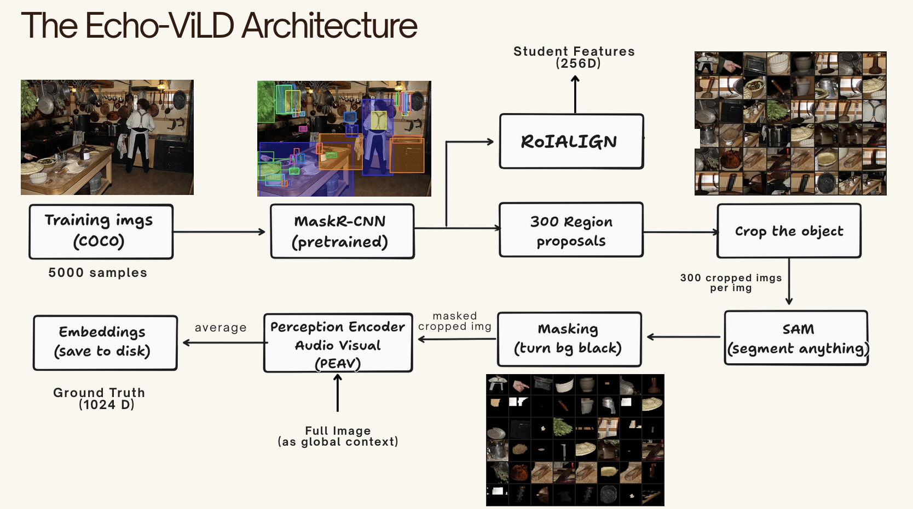
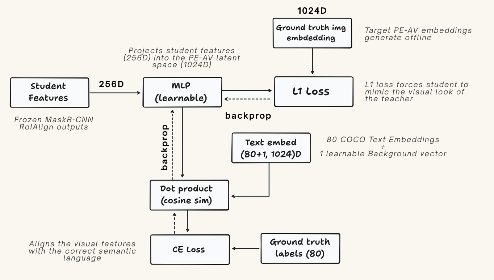

# Echo-ViLD: Segment-Guided Audio-Visual Distillation for Zero-Shot Object Detection

This repository contains the official implementation for **Echo-ViLD**, a research-oriented course project for CS 6384 (Computer Vision) at The University of Texas at Dallas.

## Project Overview

Open-Vocabulary Object Detection (OVD) models, such as [ViLD](https://arxiv.org/abs/2104.13921), successfully distill knowledge from vision-language foundation models (e.g., CLIP) to detect novel categories in a zero-shot manner. However, existing methodologies face two critical limitations:
1. **Visual Cropping Artifacts:** Distilling from rectangular bounding boxes introduces noisy background pixels and distorts aspect ratios, degrading the quality of the teacher's target embeddings.
2. **Uni-Modal Inference:** Current OVD models rely exclusively on text queries, ignoring the rich, omni-directional modality of audio for object localization.

**Echo-ViLD** addresses these limitations by introducing a novel, tri-modal distillation framework. We replace CLIP with Meta's **PEAV (Perception Audio-Visual-Text)** foundation model and introduce an offline **Segment-Guided Distillation** pipeline using the Segment Anything Model (SAM) to generate high-fidelity, background-free target embeddings. 

By mapping our student detector into PEAV's unified latent space, Echo-ViLD enables true **Zero-Shot Acoustic Object Localization**, allowing users to detect sounding objects using `.wav` audio queries.

## Report and Demo:

> To add report once completed.

The demo video is available at [link](https://youtu.be/H-bUSUaLqjo)

Model Weights: [link](https://huggingface.co/datasets/preetsojitra/Echo-VilD/tree/main)

## Key Features & Novelties

*   **Segment-Guided Distillation:** Utilizing SAM to mask background noise from RPN proposals before teacher embedding generation.
*   **Multiscale Contextual Fusion:** Fusing SAM-cleaned object embeddings with global scene context to resolve semantic ambiguity.
*   **Audio-Driven Zero-Shot Inference:** Inheriting PEAV's tri-modal latent space to enable bounding-box detection via audio clips (e.g., VGGSound).
*   **Dense LLM Prompting:** Replacing static text templates with rich, LLM-generated visual descriptions to improve cross-entropy text distillation.

---

## Project Architecture

Offline Data Preparation:

Training Methodology:

## Evaluation Metrics

### Visual Ablation Study (On [LVIS](https://www.lvisdataset.org/) dataset with text queries):

> All models were trained on 5K COCO subset.

| | | | | | |
| --- | --- | --- | --- | --- | --- |
| Method | Background | Context | Text Prompt Strategy | AP_base | AP_novel |
|Vanilla PEAV (Baseline) |Rectangular Bounding Box|None |ViLD Templates|21.5|2.3|
|SAM PEAV |Masked|None |ViLD Templates|21.8|3.8|
|SAM PEAV (equal) |Masked|Fused |ViLD Templates|20.4|4.5|
|SAM PEAV (80 20) |Masked |Fused |ViLD Templates|21.2|5.1|
|Echo-ViLD (SAM PEAV 80 20) |Masked |Fused |LLM|22.1|6.4|

### Cross Modal eval ([VPO-SS](https://github.com/cyh-0/CAVP) Dataset):
| | | | |
| --- | --- | --- | --- |
| Query Modality | Teacher Space | Dataset |AP_overall|
|Text Query (Dog barking) | PEAV-Text | VPO-SS | 14.22 |
|Audio Query (barking.wav) | PEAV-Audio | VPO-SS | 13.8|

## Team Members

1. Preet Sojitra
2. Dayoung Lim
3. Shantanu Shinde
4. Dagmawet Zemedkun

## References

1. [ViLD Paper](https://arxiv.org/abs/2104.13921)
2. [Perception Encoder Audio-Visual (PEAV)](https://arxiv.org/abs/2512.19687)
3. [SAM Paper](https://github.com/facebookresearch/segment-anything)
4. [VPO-SS](https://arxiv.org/html/2304.02970v6)